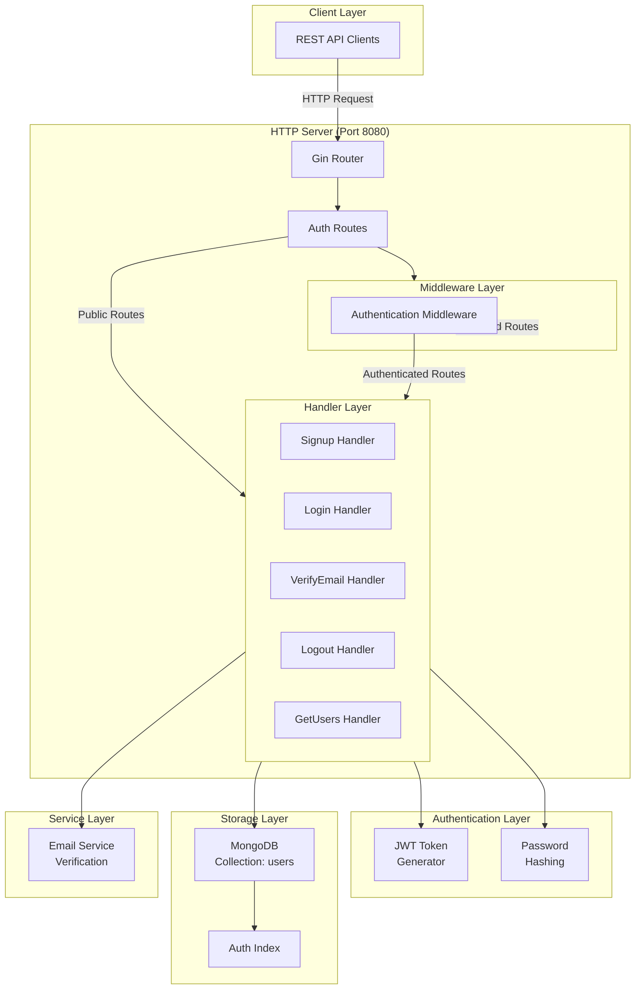
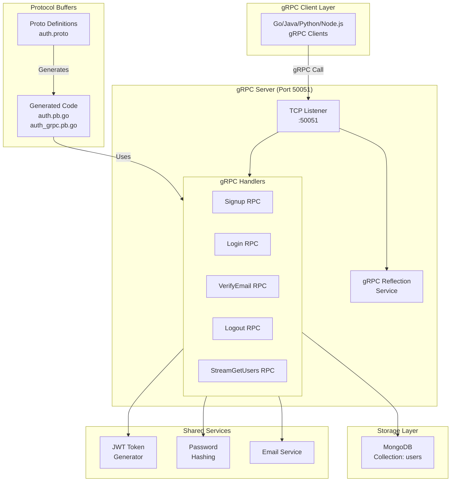
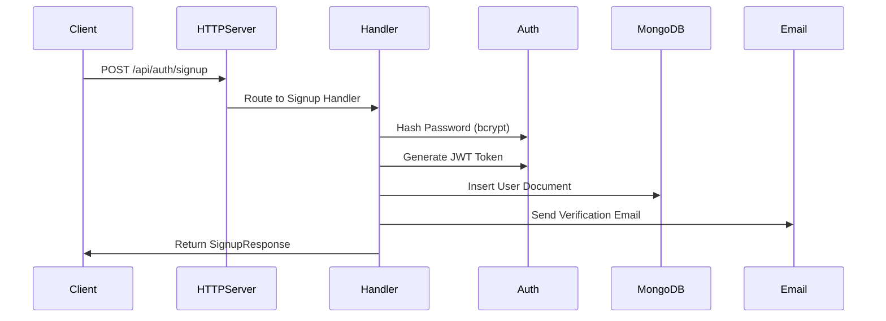
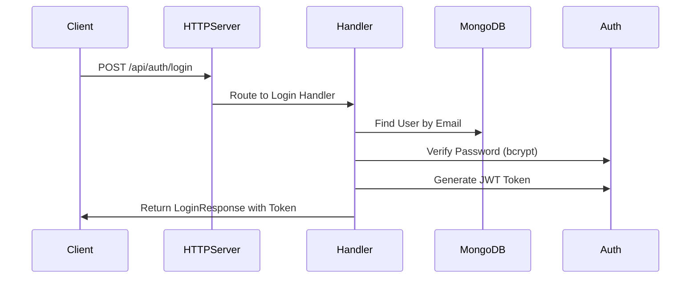

# Goth - Authentication Microservice

A production-standard authentication service built with Go, featuring both HTTP REST and gRPC APIs.

## Overview

Goth is a scalable authentication microservice that provides secure user registration, email verification, login/logout, and user management capabilities. It supports dual-protocol access through both REST APIs (HTTP) and gRPC, making it flexible for different client architectures.

## Architecture

Goth follows a modular architecture with clear separation of concerns:

```
┌─────────────────────────────────────────────────────┐
│                  Goth Microservice                   │
├─────────────────────────────────────────────────────┤
│  Routes Layer (Auth Routes)                         │
│  Handlers Layer (Business Logic)                    │
│  Middlewares (Authentication, Authorization)        │
│  Models (User Data Structure)                       │
│  Database Access Layer (MongoDB)                    │
└─────────────────────────────────────────────────────┘
```

### Technology Stack

- **Framework**: Gin (HTTP), gRPC (RPC)
- **Database**: MongoDB
- **Authentication**: JWT Tokens
- **Password Hashing**: bcrypt
- **Gomail**: For email verification
- **Language**: Go 1.16+

---

## HTTP Server

The HTTP server runs on port **8080** and provides REST API endpoints for authentication operations.

### HTTP Server Architecture



---

## gRPC Server

The gRPC server runs on port **50051** and provides high-performance RPC services using Protocol Buffers.

### gRPC Methods

| Method | Request | Response | Description |
|--------|---------|----------|-------------|
| Signup | `SignupRequest` | `SignupResponse` | Register user via gRPC |
| Login | `LoginRequest` | `LoginResponse` | Authenticate user via gRPC |
| VerifyEmail | `VerifyEmailRequest` | `VerifyEmailResponse` | Verify email via gRPC |
| Logout | `LogoutRequest` | `LogoutResponse` | Logout user via gRPC |
| StreamGetUsers | `UserListRequest` | `User` (stream) | Get all users as stream |

### gRPC Server Architecture



---

## Project Structure

```
goth/
├── main.go                    # Entry point, initializes HTTP & gRPC servers
├── go.mod                     # Go module definition
├── README.md                  # This file
├── handlers/
│   └── auth.go               # HTTP request handlers
├── grpc/
│   └── auth_grpc_server.go   # gRPC service implementations
├── routes/
│   └── auth.go               # HTTP route definitions
├── middlewares/
│   └── auth.go               # Authentication middleware
├── models/
│   └── user.go               # User data model
├── helpers/
│   ├── env.go                # Environment variable loading
│   ├── token.go              # JWT token generation/validation
│   └── email.go              # Email sending utilities
├── db/
│   ├── connect.go            # MongoDB connection
│   └── auth_index.go         # Database indexes
└── proto/
    ├── auth.proto            # Protocol Buffer definitions
    ├── auth.pb.go            # Generated Protobuf code
    └── auth_grpc.pb.go       # Generated gRPC code
```

---

## Data Flow

### User Registration (HTTP)



### User Login (HTTP)



---